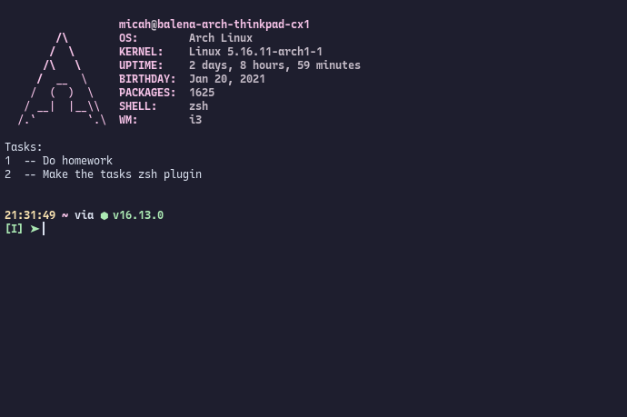

# tasks

ohmyzsh plugin for managing very simple tasks (with tab completion!)

## Usage

| Command                   | Description                    |
| ------------------------- | ------------------------------ |
| `t`                       | list all tasks                 |
| `tn <task>`               | Add task                       |
| `td <task_id>`            | Delete task with id            |
| `te <task_id> <new_task>` | Update task with new task body |
| `ts`                      | Sort tasks alphabetically      |

## Demo

## Display Tasks on Startup

Just add `echo "$(t)"` to your `.zshrc` file!

 
